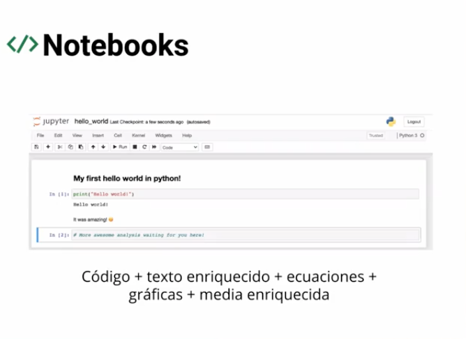
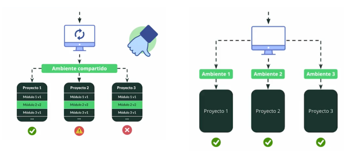
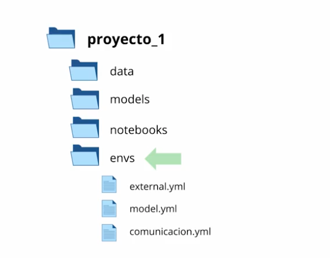

# Ambientes Virtuales

## Entornos:

- Windows (WSL)
- Linux
- macOs

## Notebooks

IPy



## Jupyter Notebooks vs Scripts

- Ambos son útiles
- Organización
- Experimentación y prototipado
- Objetivo

## Notebooks en la nube vs locales

- Ambos son útiles
- Configuración de entorno
- Tiempos de ejecución
- Escalabilidad

# **Google Colab: ciencia de datos**

[Google Colaboratory](https://colab.research.google.com/)

## ¿Google colab?

- Servicio en la nube
- Basado en Jupyter notebooks
- No requiere configuración
- Trabajo a nivel archivo
- Uso gratuito de GPUs y TPUs

# Deepnote: ciencia de datos

Características de Deepnote

- Servicio en la nube
- Basada en Jupyter Notebooks
- Trabajo a nivel de proyecto (tener una carpeta)
- Colaboración en tiempo real
- Integración de Apps
- Terminal y línea de comandos
- Almacenamiento de variables de entorno
- Publicar proyectos

[Deepnote - Data science notebook for teams](https://deepnote.com/)

Otra opción similar:

[Gradient - Use machine learning to make anything.](https://gradient.run/)

# VSCode

[Visual Studio Code - Code Editing. Redefined](https://code.visualstudio.com/)

1. Instalar VSCode
2. Instalar SWL (para usuarios Windows)
3. Agregar extensiones para VSCode: Remote WSL, Python, MagicPython, Material Icon Theme, Rainbow Brackets, Remote Development.
4. VSCode notebooks: crear archivo con extensión *.ipynb

# Ambientes virtuales

Proyecto que puede tener sus propias dependencias, independientemente de las dependencias que tengan los demás proyectos.



## Conda

Gestión de paquetes, dependencias y entornos para cualquier lenguaje: Python, R, Ruby, Lua, Scala, Java, JavaScript, C/ C++, Fortran y más.


[Anaconda | Anaconda Distribution](https://www.anaconda.com/products/distribution)

```bash
# Instalación para Linux
wget -O anaconda.sh https://www.anaconda.com/products/distribution/....sh
bash anaconda.sh
```

### Crear ambiente virtual

Para listar los ambientes 

```bash
conda env list
```

Crear un ambiente con python versión 3.5 y la ultima versión de pandas

```bash
conda create --name py35 python=3.5 pandas
```

Para activar ambientes

```bash
conda activate py35
```

Para desactivar un ambiente

```bash
conda deactivate
```

Para listar los paquetes instalados en un ambiente

```bash
conda list
conda list pandas
```

Para actualizar una versión de una biblioteca

```bash
conda update pandas
```

Para instalar una versión

```bash
conda install opencv
conda install pandas=1.2
conda install python=3.9 pandas=1.2
```

Actualizar el nombre de un ambiente

```bash
conda create --name py39 --copy --clone py35
```

### Eliminar ambientes y bibliotecas

```bash
conda remove pandas
```

Para eliminar ambiente

```bash
conda env remove --name py35
```

### Comandos avanzados

```bash
conda intall boltons
```

Error: porque no está en ningún canal.  Se realiza la búsqueda del canal donde se encuentra el paquete en: [anaconda.org](https://anaconda.org). Una vez identificado el canal se ejecuta la instalación de la siguiente forma:

```bash
conda intall --channel conda-forge boltons
```

Se utiliza el flag `--channel` para indicar el canal donde se encuentra la biblioteca que requerimos instalar.

Para revisar el estado del ambiente (es un seguimiento del estado del ambiente), se realizan un listado de las revisiones:

```bash
conda install --revision
```

Podemos volver a revisión previa, ejemplo: para regresar a la revisión 0

```bash
conda install --revision 0
```

Para compartir un ambiente

```bash
conda env export --from-history --file environment.yml
```

Como instalar un ambiente que se ha compartido

```bash
conda env --file environment.yml
```

## Mamba

Una re-implementación de Conda, debido a la necesidad de ambientes complejos

```bash
conda install --chanel conda-forge mamba
```

Ayuda de mamba

```sql
mamba --help
```

Crear ambiente con mamba a partir de un yml

```sql
mamba env create --file environment.yml
```

https://github.com/mamba-org/mamba

[Welcome to Mamba's documentation!](https://mamba.readthedocs.io/en/latest/)

# Divide y venceras

Múltiples ambientes para un solo proyecto, con la finalidad de que rompa el ambiente en alguna actualización



La solución es a través de **Snakemake**

https://github.com/snakemake/snakemake

[Snakemake - A framework for reproducible data analysis](https://snakemake.github.io/)